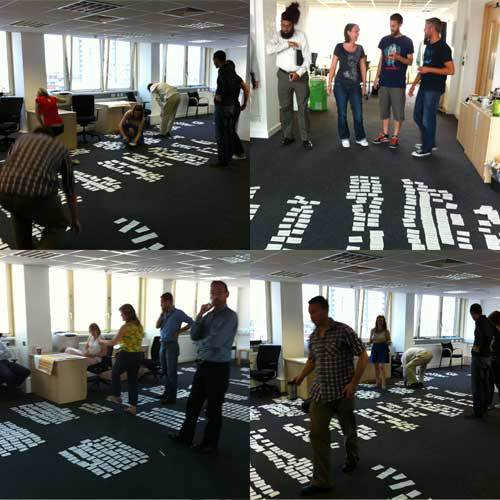

# david

!SLIDE

# Building APIs by building on APIs

## @psd
## @dgheath21

!SLIDE

# History

!SLIDE

Directgov 2010 and beyond: revolution not evolution, a report by Martha Lane Fox

!NOTES

> In 2011, Martha Lane Fox published an influential report on the state of for Government, advocating "revolution, not evolution" and calling for government to act as a "wholesaler as well as the retail shop front for services and content by mandating the development and opening up of Application Programme Interfaces (APls) to third parties". 

> This talk is a tour of the UK Government Digital Service API Design Principles, the lessons learnt from building the GOV.UK publishing platform and transactional services on APIs, and how these design principles are now being applied to enable departments and agencies across government to transform transactions and services into becoming "digital by default".

!SLIDE

# Wholesale not retail

> Make government a wholesaler as well as the retail shop front for government services & content by mandating the development and opening up of Application Programme Interfaces (APIs) to third parties.

!SLIDE

}}} images/alphagov.png

!NOTES

- We built an Alpha, people liked it. 

!SLIDE

# User needs research

!NOTES
- spent time and effort stepping back to re-asses user needs

!SLIDE

# Beta architecture

Compose loosely coupled services using RESTful APIs.

!SLIDE

# Why?

smaller pieces are easier to grok

each piece can evolve independently

at different speeds or in parallel

!SLIDE

# Problems

hard to refactor across service boundaries

need to be strict about decoupling services

end-to-end integration testing hard

!SLIDE

